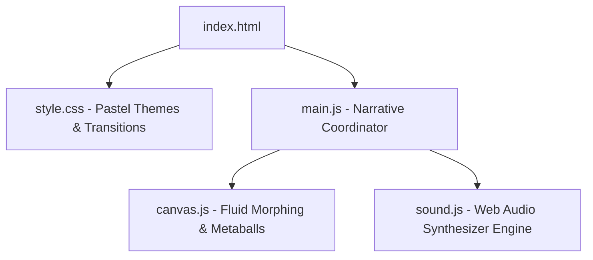

# Plan: Standalone Interactive Congratulatory Website for Mom - "Поток Тепла" (The Flow of Warmth)

This project is a premium, deeply emotional, interactive web-experience built with modern HTML5 Canvas, responsive CSS transitions, and procedurally synthesized ambient Web Audio. It features an **organic fluid-like pastel theme** with responsive, tactile sound effects that create an immersive, soulful atmosphere without requiring external images or audio files.

---

## 🎨 Visual Identity & Theme (Organic Pastel Fluid)
- **Palette**: Dynamic, transitioning pastel gradients.
  - *Rose Gold / Soft Pink*: `#FAD0C4`, `#FFD1FF` (Warmth, love)
  - *Lavender / Periwinkle*: `#E0C3FC`, `#8EC5FC` (Tranquility, depth)
  - *Mint / Sage*: `#D4FC79`, `#96E6A1` (Growth, life)
  - *Peach / Apricot*: `#FED06E`, `#FF9A9E` (Joy, comfort)
- **Fluid Animation (`canvas.js`)**:
  - Soft, morphing Bézier curves or mathematical metaballs rendering organic "blobs".
  - Blobs react to mouse position, moving fluidly, stretching, merging, and parting.
  - Interactive ripple physics on click/drag.
- **Typography**:
  - Headings: Serif, elegant, classic (e.g., `'Playfair Display'`, `'Cinzel'`, or `'Marcellus'`).
  - Body: Sans-serif, clean, highly readable (e.g., `'Montserrat'`, `'Inter'`).
  - Font styling includes smooth letter-spacing, elegant fades, and soft glowing dropshadows.

---

## 🎵 Audiovisual Concept (Web Audio API Synthesizer)
To guarantee instant loading and robust playback, we synthesize all audio dynamically in the browser using the **Web Audio API**:
- **Ambient Pad**: A constant, low-frequency, multi-oscillator synthesizer pad (using triangle/sine waves, a low-pass filter, and soft LFO modulation) playing beautiful major seventh/ninth chords (e.g., Fmaj9, Cmaj9, Gmaj9) to create a warm, enveloping hug of sound.
- **Chimes & Bells**: High-pitched, resonant oscillators with rapid attack and long, exponential decay, tuned to a beautiful pentatonic scale (e.g., C Major Pentatonic: C4, D4, E4, G4, A4, C5). Triggered by mouse movement and clicks on interactive elements.
- **Interaction SFX**: Custom filter sweeps and delay lines that trigger on screen transitions and element hovers, offering sensory satisfaction.

---

## 📖 The Narrative Structure (Page-by-Page)

### Screen 1: The Origin (Исток)
- **Text (RU)**:
  - *Title*: `Маме.` (To Mom.)
  - *Subtitle*: `Есть свет, который никогда не угасает...` (There is a light that never fades...)
- **Visuals**: A single, soft, gently breathing golden-pink pastel blob in the center.
- **Interaction**:
  - Hovering over the blob makes it expand slightly, shifting colors dynamically.
  - A subtle pulse invitation to click.
  - Button: `"Войти в поток"` (Enter the flow). Clicking initializes the Web Audio API context with a soft, swelling synthesizer chord and transitions smoothly to Screen 2.

### Screen 2: The Warmth of Hands (Тепло рук)
- **Text (RU)**:
  - *Title*: `Тепло твоих рук` (The warmth of your hands)
  - *Paragraph*: `Твоё тепло создало мой мир. Оно оберегает, согревает и направляет сквозь любые шторма. В самые холодные дни я чувствую твою заботу.`
- **Visuals**: 3-4 distinct pastel blobs (lavender, soft gold, mint) that drift lazily and merge organically when they get close to each other or the cursor.
- **Interaction**:
  - Dragging/moving the cursor repels or attracts the blobs (fluid-like behavior).
  - Sound: Each cursor movement generates soft, rhythmic chime patterns that follow the speed of movement.

### Screen 3: The Garden of Gratitude (Сад благодарности)
- **Text (RU)**:
  - *Title*: `Сад благодарности` (The garden of gratitude)
  - *Instruction*: `Прикоснись к сияющим искрам памяти...` (Touch the shining sparks of memory...)
- **Visuals**: Floating, glowing pastel "seeds of light" dispersed across a fluid field.
- **Interaction**:
  - Clicking on a seed opens a gorgeous overlay card containing a deep, poetic thank-you message in Russian:
    1. 🌸 `"За безусловную любовь и принятие в любой миг."`
    2. ✨ `"За твои нежные руки, способные утешить любую боль."`
    3. 🌱 `"За веру во меня, даже когда весь мир сомневался."`
    4. 🕯️ `"За тихий свет мудрости, освещающий мой путь в темноте."`
    5. 🎁 `"За самый великий дар — за жизнь и веру в чудо."`
  - Sound: Each click plays a highly resonant crystal bell sound tuned to a specific pentatonic note, allowing the user to "play" a musical scale of gratitude.

### Screen 4: The Symphony of the Heart (Симфония сердца)
- **Text (RU)**:
  - *Title*: `Биение сердца` (The heartbeat)
  - *Paragraph*: `Каждое моё биение — это эхо твоей безграничной любви. В самом центре моей души всегда звучит твоя мелодия.`
- **Visuals**: All fluid blobs merge back into a single, pulsing, morphing central heart/star shape. It beats slowly, shifting color gracefully.
- **Interaction**:
  - Clicking/dragging on the central shape causes it to vibrate, generating a sweeping, beautiful synthesizer filter sweep (making the ambient chord feel alive and radiant).

### Screen 5: The Endless Ocean (Бесконечный океан)
- **Text (RU)**:
  - *Title*: `С праздником, мамочка!` (Happy Holiday, Mommy!)
  - *Paragraph*: `Пусть этот океан нежности, тепла и покоя окружает тебя каждый день. Ты — моё самое дорогое сокровище. Люблю тебя бесконечно!`
- **Visuals**: The screen background shifts to an endless wave-like generative fluid simulation, with gentle pastel waves cascading downward.
- **Interaction**:
  - Moving the cursor spawns beautiful, trailing pastel sparks that drift upwards, accompanied by gentle, random wind-chime chords.
  - A button to `"Начать сначала"` (Restart journey) to play again.

---

## 🛠️ Technical Implementation Strategy

### Key Highlights:
1. **Interactive Fluid Canvas**:
   - Built on a dynamic `window.requestAnimationFrame` loop.
   - Blob rendering utilizes organic math: `x = cx + r * cos(theta) + noise`, with perlin/simplex-like wave structures based on time to simulate morphing.
   - Color styling uses `ctx.createRadialGradient` and canvas blending filters (`ctx.globalCompositeOperation = 'screen'`) to achieve a beautiful, glowy, ethereal pastel effect.
2. **Audio Synthesis Architecture**:
   - **Engine Initialization**: Triggered on first user interaction to comply with browser autoplay policies.
   - **Continuous Pad**: Two detuned low-frequency Triangle wave oscillators running through a `BiquadFilterNode` (Lowpass, ~400Hz frequency) with a slow `GainNode` gain LFO (modulating volume slightly to make it breathe).
   - **Interactive Bells**: Dynamic creation of `OscillatorNode` (Sine/Triangle blend for purity), a high-pass filter, and a gain envelope with `linearRampToValueAtTime` (0.01s attack) and `exponentialRampToValueAtTime` (3s release to zero).
3. **Responsive UI & Animations**:
   - Modern Tailwind CSS styles can be achieved easily using pure elegant CSS variables, modern flex/grid layouts, and sleek `@keyframes` to preserve lightweight, zero-dependency requirements.
   - Elegant typographic spacing, drop shadows, and delicate animations.
